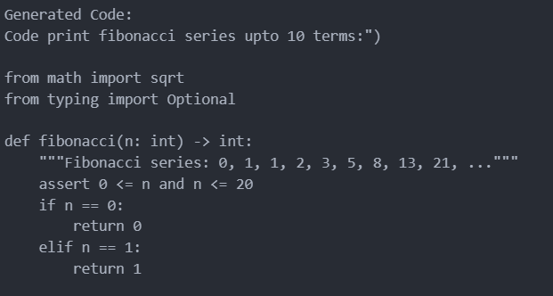

# Code Generator


The **Code Generator** is a **Python**-based project designed to generate code snippets using a fine-tuned machine learning model. It leverages advanced libraries such as **TensorFlow** and **PyTorch** for model training and inference, enabling efficient and powerful code generation.


## 📁 Folder Structure
```
Code Generator/
    ├── data/                       # Contains datasets used for training and testing the model
    ├── img/                        # Stores output images
    │   └── output.png             # Example of generated code output
    ├── logs/                       # Log files generated during execution
    ├── results/                    # Stores results of the model evaluations
    ├── main.py                     # Main script to run the code generation
    └── python_code_snippet_collector.py  # Utility script for collecting code snippets
```

## 🚀 Usage
1. **Installation**: Ensure you have Python 3.8 or higher installed along with the required libraries. Install the necessary libraries using pip:

   ```bash
   pip install -U PyGithub datasets transformers torch tensorflow tf-keras==0.26.0
   ```

2. **Running the Code Generator**: 
   - Execute the main script to start generating code snippets:

   ```bash
   python main.py
   ```

   - **Modify and Run Code Snippets**: You can customize your code generation by editing the `python_code_snippet_collector.py` file with different datasets or prompts. Run this file to generate various outputs based on your changes.

## 📥 Output
The generated output will be saved in the `results/` folder. Below is a sample of the generated code:



## 📝 Logs
For debugging and tracking purposes, logs of the execution can be found in the `logs/` folder.

## 🤝 Contributing
Feel free to contribute to the project by submitting issues or pull requests. Your feedback and suggestions are welcome!

## 📄 License
This project is licensed under the MIT License. See the [LICENSE](LICENSE) file for details.

