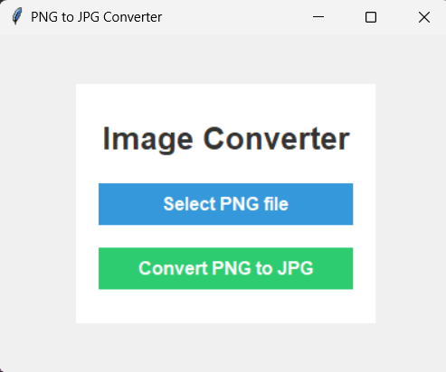

# PNG to JPG Converter

  

This is a simple Python-based desktop application that converts **PNG images** to **JPG format** using the `Tkinter` library for the GUI and the `Pillow` library for image processing.

## 🚀 Features

- User-friendly GUI built with **Tkinter**.
- Converts **PNG** images to **JPG**.
- Error handling for invalid file types and conversion issues.
- Modern, clean interface with minimal design.

## 🖼️ Preview



*Example of the PNG to JPG conversion process.*

## 📂 Folder Structure

```bash
Python-Projects/
│
└───Image-Converter/
    │
    ├── README.md         # Project documentation
    ├── converter.py      # Main application script
    └── requirements.txt  # Python dependencies
```

## 🛠️ Installation

Follow these steps to get the project up and running on your local machine.

1. **Clone the repository**:
   ```bash
   git clone https://github.com/arnabsaha7/Python-Projects.git
   cd Python-Projects/Image_Converter
   ```

2. **Create a virtual environment** (optional but recommended):
   ```bash
   python3 -m venv venv
   source venv/bin/activate  # On Windows: venv\Scripts\activate
   ```

3. **Install the required dependencies**:
   ```bash
   pip install -r requirements.txt
   ```

## 🖥️ Usage

To run the converter, simply execute the `converter.py` script:

```bash
python converter.py
```

1. Click **"Select PNG file"** to choose a PNG image from your system.
2. Once the PNG file is loaded, click **"Convert PNG to JPG"** to save the converted image.
3. Choose the save location and the file will be converted and saved as **JPG**.

## 🧰 Requirements

- Python 3.8+
- `tkinter` (comes with Python by default)
- `Pillow` (Python Imaging Library)

You can install the required libraries using:

```bash
pip install pillow
```

## ✨ GUI Design

The application interface follows a modern design style with a focus on simplicity and ease of use. Key components include:

- **Title Bar**: Displays "Image Converter" in bold with a neutral color scheme.
- **Select Button**: Allows the user to load a PNG image.
- **Convert Button**: Converts the loaded PNG to JPG and prompts the user to save the result.

## 🤝 Contributing

Contributions are welcome! If you'd like to improve the project, follow these steps:

1. Fork the repository.
2. Create a new branch (`git checkout -b feature-branch`).
3. Make your changes.
4. Push your branch (`git push origin feature-branch`).
5. Open a pull request.

## 📜 License

This project is licensed under the MIT License. See the [LICENSE](../LICENSE) file for more information.

---

### ✨ Happy Coding! ✨

Feel free to reach out if you have any questions or feedback on the project.

---

