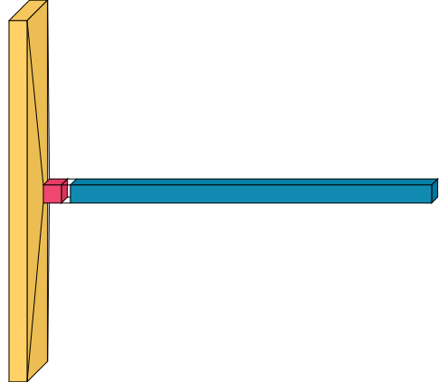

# Text Generation using LSTM and Keras


This project demonstrates an advanced **Text Generation** model using an **LSTM** (Long Short-Term Memory) neural network built with **TensorFlow/Keras**. The model learns from a given dataset of text and predicts the next word in a sequence, allowing you to generate new, coherent sentences from a seed phrase.

---

## ✨ Features
- **Text Tokenization**: Converts text into sequences using Keras's `Tokenizer`.
- **Sequence Padding**: Pads sequences to ensure uniform input length.
- **LSTM Model**: Captures temporal dependencies in the sequence data.
- **Checkpointing**: Saves the best-performing model during training.
- **Text Generation**: Allows dynamic generation of text using a trained model and an input seed.

---

## 📊 Model Architecture

Below is the architecture of the LSTM model used in this project. It features an Embedding layer for word representation, followed by an LSTM layer, and finally a Dense layer for generating output probabilities over the vocabulary.



>    🟨: **Embedding Layer**   🟥: **LSTM Layer**   🟦: **Dense Layer**

---

## 🚀 How It Works

1. **Text Data Processing**:
   - Text is tokenized into sequences.
   - Sequences are padded to ensure consistent input length.

2. **Model Training**:
   - The LSTM model is trained to predict the next word based on a sequence of prior words.
   - The `ModelCheckpoint` callback ensures that only the best model (with the lowest loss) is saved.

3. **Text Generation**:
   - The trained model is used to generate text by taking a seed phrase and predicting subsequent words.

---

## 🛠 Usage

1. **Clone the repository**:
   ```bash
   git clone https://github.com/arnabsaha7/Python-Projects/Next-Word-Prediction.git
   cd Next_Word_Prediction
   ```

2. **Install dependencies**:
   ```bash
   pip install -r requirements.txt
   ```

3. **Train the model and generate text**:
   ```bash
   python text_generator.py
   ```

4. **Input a seed phrase** when prompted, and the model will generate new text based on your input.

---

## 💻 Example

Here’s an example of what the model can generate:

```
Input: "Once upon a"
Output: "Once upon a time the"

Input: "I was going to"
Output: "I was going to watch you but"
```

The output will vary based on the input seed and the model's learning.

---

## 📂 Project Structure

```
.
├── data
│   └── dataset.txt       # Input text data for training
├── img
│   └── output.png        # Model architecture visualization
├── model
│   └── model_checkpoint.keras  # Saved model during training
├── text_generator.ipynb     # Main Jupyter Notebook script for training and text generation
├── requirements.txt      # List of project dependencies
└── README.md             # Project README file
```

---

## 📄 License

This project is licensed under the MIT License. See the [LICENSE](LICENSE) file for more details.

