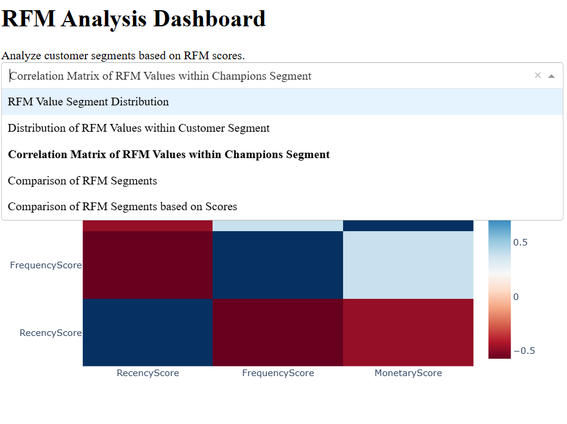
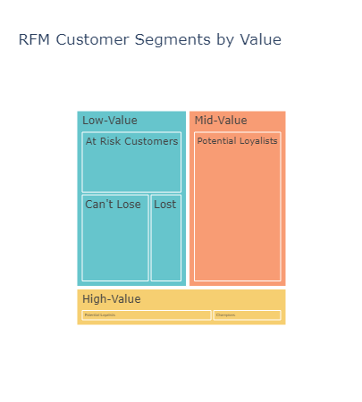
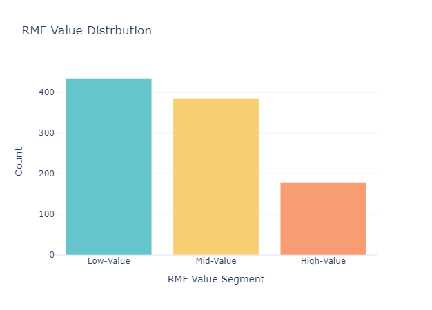
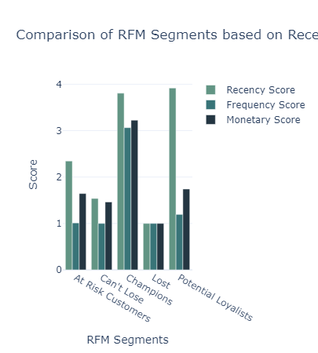
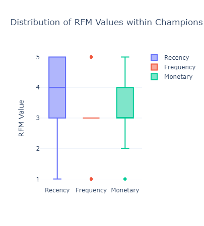
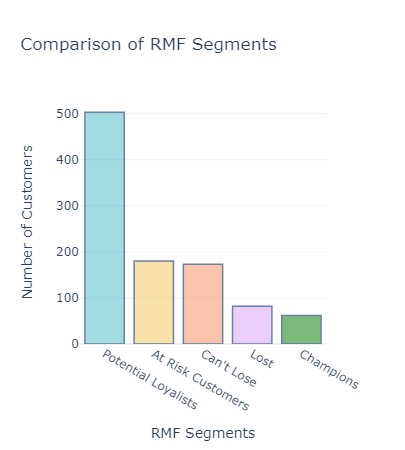

# **RMF Analytics Dashboard**


The RMF Analytics Dashboard is designed to provide insightful analysis of customer segments, their value distribution, and performance comparisons. This dashboard empowers data-driven decision-making for enhanced customer relationship management.

## **Overview**

<p align="left">
  
</p>


## **Features**

- Interactive visualizations for customer segmentation.
- Value distribution analysis.
- Comparison metrics for RMF (Recency, Frequency, Monetary) values.
- Easy-to-use interface for exploring data.


## **Images**

### Key Visualizations

|  |  |  |
|:---:|:---:|:---:|
| **Customer Segment** | **Value Distribution** | **Segmentation Comparison** |

|  |  |  |
|:---:|:---:|:---:|
| **Distribution** | **RMF Comparison** | **RMF Value Distribution** |

--- 
## **Getting Started**

### Prerequisites

Ensure you have the following installed:
- Python 3.8 or later
- Required libraries: Pandas, Plotly, Dash

### Installation

1. Clone the repository:
   ```bash
   git clone https://github.com/arnabsaha7/Python-Projects.git
   ```
2. Navigate to the RMF_Analytics_Dashboard folder:
   ```bash
   cd Python-Projects/RMF_Analytics_Dashboard
   ```
3. Install required libraries:
   ```bash
   pip install pandas plotly dash
   ```

### Usage

Run the dashboard using:
```bash
python app.py
```
Open your web browser and go to `http://127.0.0.1:5000` to view the dashboard.

## License

This project is licensed under the MIT License. See the [LICENSE](LICENSE) file for details.
