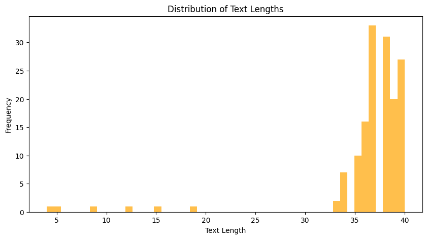
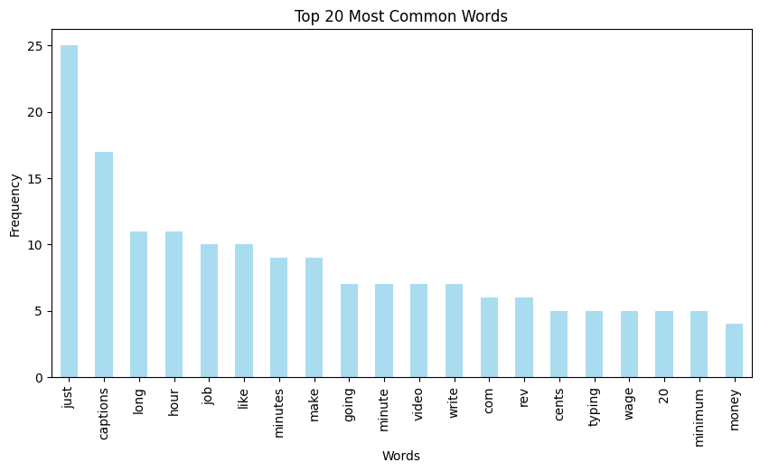

# 📼 Video Chaptering with YouTube Transcripts


Easily generate meaningful chapters for YouTube videos by analyzing their transcripts. This tool automates the segmentation of videos based on topic shifts, creating an organized and chaptered viewing experience for long-form content.

---

## 🌟 Features

- **Automatic Transcript Extraction:** Pulls video transcripts directly from YouTube using the YouTube API.
- **Topic Segmentation:** Detects topic shifts using Natural Language Processing (NLP) and Non-negative Matrix Factorization (NMF).
- **Chapter Generation:** Automatically creates logical breaks and chapter points.
- **Auto Chapter Naming:** Generates meaningful chapter titles based on transcript key phrases.
- **Visual Insights:** Displays word frequency and text length distribution for deeper understanding.

---

## 🚀 Getting Started

Follow these steps to get started with video chaptering:

### 1. Clone the Repository

```bash
git clone https://github.com/arnabsaha7/Python-Projects/Video-Chaptering.git
cd Video-Chaptering
```

### 2. Install Dependencies

```bash
pip install -r requirements.txt
```

### 3. Run the Chaptering Script

Run the script and enter a YouTube video URL to extract its transcript and generate chapters.

```bash
python video_chaptering.py
```

---

## 📋 Example Workflow

**1. Input the YouTube Video URL:**

```bash
Enter the YouTube Video Link: https://www.youtube.com/watch?v=STN2mLXr6lQ
Transcript saved to STN2mLXr6lQ_transcript.csv
```

**2. Analyze Transcript:**

```bash
Dataset Overview:
<class 'pandas.core.frame.DataFrame'>
RangeIndex: 300 entries, 0 to 299
...
```

**3. Generate Chapters:**

```bash
Final Chapter Points with Names:
00:01:15 - Chapter 1: deep learning machine
00:05:30 - Chapter 2: policy reinforcement learning
...
```

---

## 📊 Visual Insights

The project also provides visualizations of word frequency and text length distribution:

- **Text Length Distribution:**



- **Top 20 Most Common Words:**



---


## 🔮 Future Enhancements

- Support for multilingual transcripts.
- User-configurable topic threshold sensitivity.
- Web-based front-end interface.

---

## 📝 License

This project is licensed under the MIT License. See the [LICENSE](LICENSE) file for more details.

---

This updated README includes shields for dependencies and key libraries, which add a modern and professional touch to the presentation of your project.